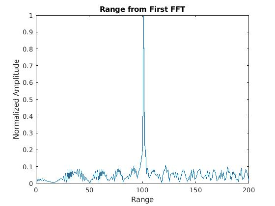
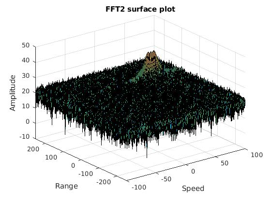
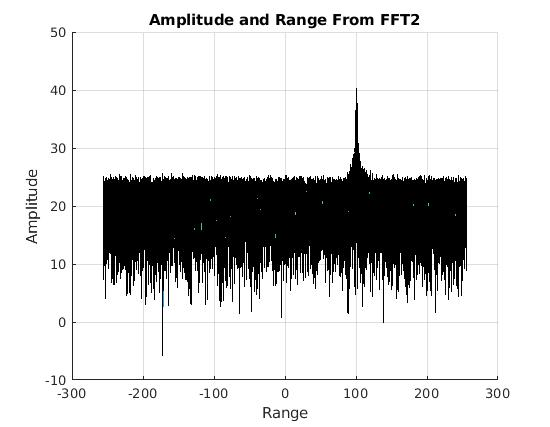
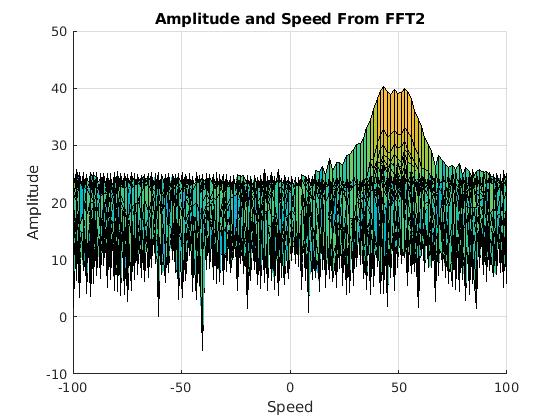
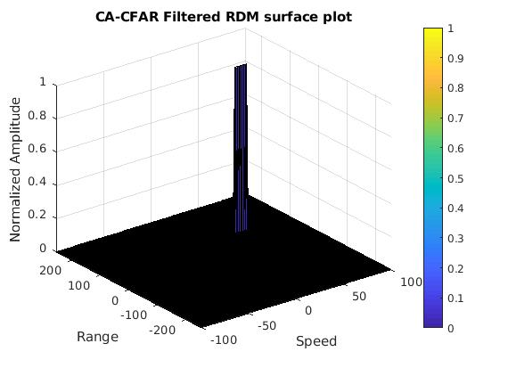
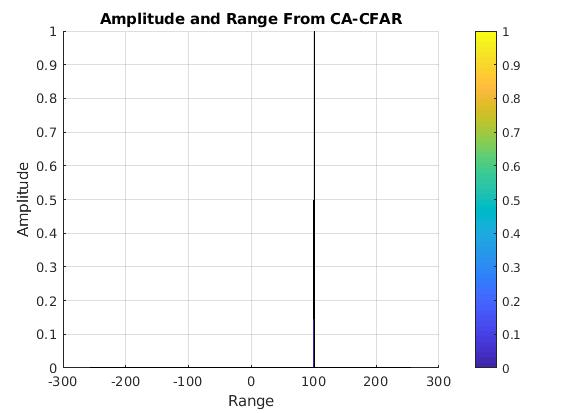
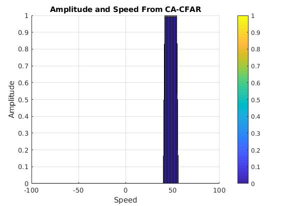

# Implementation steps for the 2D CFAR process.
## False Alarm Rate
A false alarm is an erroneous radar target detection caused by noise or other interfering signals exceeding the detection threshold.

To avoid false detection due to constant threshold value to remove clutter we implement dynamic thresholding. Dynamic thresholding involves varying the threshold level to reduce the false alarm rate.

## Constant False Alarm Rate (CFAR)
 Constant false alarm rate (CFAR) is a dynamic thresholding scheme, which varies the detection threshold as a function of the sensed environment. In this technique, the noise at every or group of range/doppler bins is monitored and the signal is compared to the local noise level. This comparison is used to create a threshold which holds the false alarm rate constant.

 The CFAR technique estimates the level of interference in radar range and doppler cells "Training Cells" on either or both the side of the "Cell Under Test". The estimate is then used to decide if the target is in the Cell Under Test (CUT). This process loops across all the range cells and decides  the presence of target based on the noise estimate. The basis of the process is that when noise is present, the cells around the cell of interest will contain a good estimate of the noise, i.e. it assumes that the noise or interference is spatially or temporarily homogeneous.

 

 *CACFAR (source:http://www.radartutorial.eu/)*

Cell Averaging Constant False Rate Alarm  (CA-CFAR) is the most commonly used CFAR detection technique.

 ## 2D CFAR steps


*2D CA CFAR (source:electronicproducts.com)*

2D CA CFAR technique has been implemented as shown in the lecture videos. Following steps were implemented-

1. Determine the number of training cells for each dimension Tr and Td. Similarly, pick the number for guard cells Gr and Gd.

2. Slide the cell under test (CUT) across the complete cell matrix.

3. For every iteration sum the signal level within all the training cells. To sum convert the value from logarithmic to linear using dbpow2 function.

4. Average the summed values for all of the training cells used. After averaging convert it back to logarithmic using pow2db.

5. Further add the offset to it to determine the threshold.

6. Next, compare the signal under CUT against this threshold.

7. If the CUT level > threshold assign it a value of 1, else equate it to 0.

8. To keep the map size same as it was before CFAR, equate all the non-thresholded cell to 0.

```matlab script
%Select the number of Training Cells in both the dimensions.
Tr = 10;
Td = 8;

%Select the number of Guard Cells in both dimensions around the Cell under
%test (CUT) for accurate estimation
Gr = 4;
Gd = 4;

% offset the threshold by SNR value in dB
offset = 1.4;

% Use RDM[x,y] as the matrix from the output of 2D FFT for implementing
% CFAR

RDM = RDM/max(max(RDM)); % Normalizing

for i = Tr+Gr+1:(Nr/2)-(Tr+Gr)
    for j = Td+Gd+1:(Nd)-(Td+Gd)
        %Create a vector to store noise_level for each iteration on training cells
        noise_level = zeros(1,1);

        for p = i-(Tr+Gr) : i+(Tr+Gr)
            for q = j-(Td+Gd) : j+(Td+Gd)
                if (abs(i-p) > Gr || abs(j-q) > Gd)
                    noise_level = noise_level + db2pow(RDM(p,q));
                end
            end
        end

        % Calculate threshould from noise average then add the offset
        threshold = pow2db(noise_level/(2*(Td+Gd+1)*2*(Tr+Gr+1)-(Gr*Gd)-1));
        threshold = threshold + offset;
        CUT = RDM(i,j);

        if (CUT < threshold)
            RDM(i,j) = 0;
        else
            RDM(i,j) = 1;
        end

    end
end
```

# Selection of Training, Guard cells and offset.
- Number of Training cells in range dimension (Tr) = 10
- Number of Training cells in doppler dimension (Td) = 8
- Number of Guard cells in range dimension (Gr) = 4
- Number of Guard cells in doppler dimension (Gd) = 4
- Offset = 1.4

# Steps taken to suppress the non-thresholded cells at the edges.
The process above will generate a thresholded block, which is smaller than the Range Doppler Map as the CUT cannot be located at the edges of matrix. Hence, few cells will not be thresholded. To keep the map size same set those values to 0.

Any cell value that is neither 1 nor a 0, assign it a zero.
```matlab script
RDM(RDM~=0 & RDM~=1) = 0;
```
# Output

```matlab script
% define the target's initial position and velocity. Note : Velocity
% remains contant
Range_of_target = 100;
Velocity_of_target = 50;
```



*Range*



*2D FFT Surface Plot*



*Range from FFT2*



*Speed from FFT2*



*CACFAR Surface Plot*



*Range from CA-CFAR*



*Speed from CA-CFAR*
